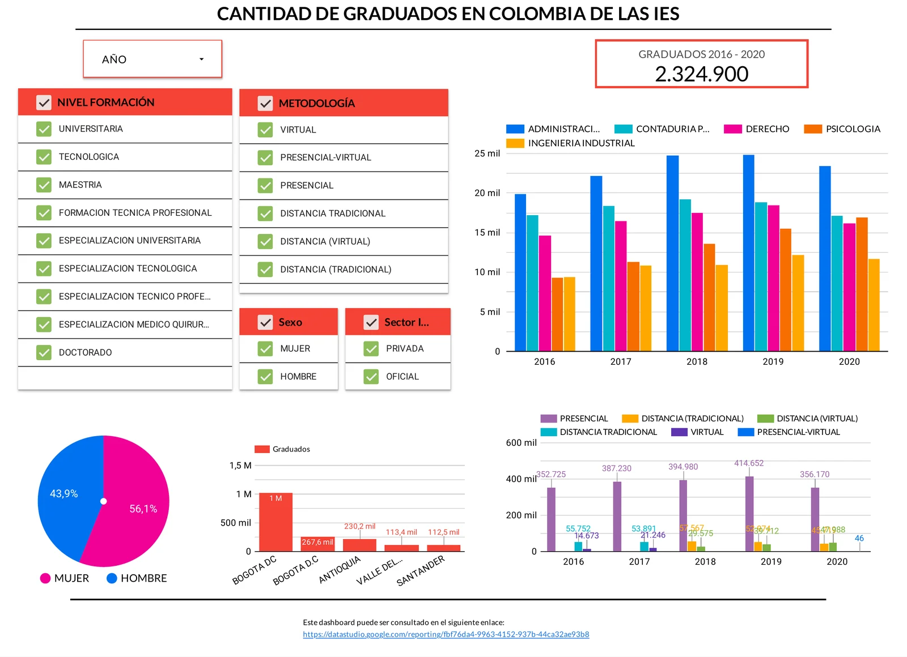
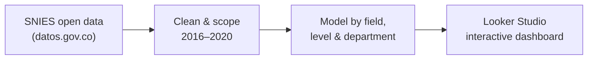

# Colombia Higher-Education Graduates Dashboard

**Looker Studio** dashboard analysing official data on graduates from Colombian higher-education institutions, published by the Ministry of National Education on datos.gov.co.

> **Status: archived.** The source dataset (*MEN — Graduados de Educación Superior*, `xqxc-j3uf`) was later removed from datos.gov.co, so the live Looker Studio report no longer loads. The report below is an export of the working dashboard.

### 📄 [View the archived report (PDF)](Proyecto_Final_-_Equipo_113.pdf)

## What it answers

The dashboard surfaces trends and patterns in **2,324,900** Colombian higher-education graduates across three dimensions:

- **Field of knowledge** — which areas produce the most graduates and how that shifts over time.
- **Education level** — undergraduate vs postgraduate distribution.
- **Geography** — graduates by department, to see regional concentration.

## Highlights

- Built on the official **SNIES / datos.gov.co** open dataset (graduates 2001–2020).
- Scoped the analysis to the **most recent five years (2016–2020)** — a deliberate decision to stay within Looker Studio's free-tier data limits without losing the relevant signal.
- Delivered a decision-ready report aimed at non-technical education stakeholders.

## Process

## Data source

*MEN — Graduados de Educación Superior* (datos.gov.co, dataset `xqxc-j3uf`). No longer available on the portal.

## Context

Final project of the **Correlation One — DS4A / Colombia** Data Analytics programme, built by Sebastian Belalcazar and Jimmy Moreno (Team 113).

## Tech

Looker Studio · Data Visualisation · Public open data (SNIES)
