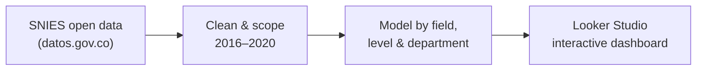

# Colombia Higher-Education Graduates Dashboard

Interactive **Looker Studio** dashboard analysing official data on graduates from Colombian higher-education institutions, published by the Ministry of National Education on [datos.gov.co](https://www.datos.gov.co/Educaci-n/MEN_GRADUADOS_DE_EDUCACI-N_SUPERIOR/xqxc-j3uf).

### ▶️ [Open the live dashboard](https://lookerstudio.google.com/reporting/fbf76da4-9963-4152-937b-44ca32ae93b8/page/p_uounofjj1c)

## What it answers

The dashboard surfaces trends and patterns in Colombian higher-education graduates across three dimensions:

- **Field of knowledge** — which areas produce the most graduates and how that shifts over time.
- **Education level** — undergraduate vs postgraduate distribution.
- **Geography** — graduates by department, to see regional concentration.

## Highlights

- Built on the official **SNIES / datos.gov.co** open dataset (graduates 2001–2020).
- Scoped the analysis to the **most recent five years (2016–2020)** — a deliberate decision to stay within Looker Studio's free-tier data limits without losing the relevant signal.
- Delivered a clean, decision-ready report aimed at non-technical education stakeholders.

## Process

## Data source

[MEN — Graduados de Educación Superior · datos.gov.co](https://www.datos.gov.co/Educaci-n/MEN_GRADUADOS_DE_EDUCACI-N_SUPERIOR/xqxc-j3uf)

## Context

Developed within the **Correlation One — DS4A / Colombia** Data Analytics programme.

## Tech

Looker Studio · Data Visualisation · Public open data (SNIES)
